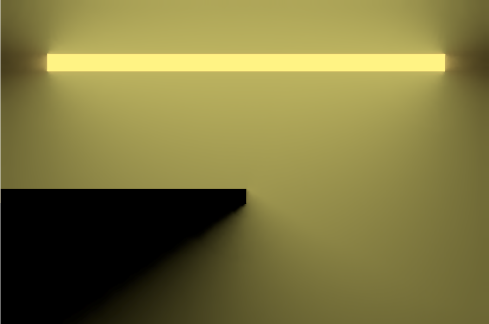

# Radiance Cascades Demo



2D radiance cascades implementation via Raylib. Check [releases](https://github.com/aphidarium/radiance-cascades-demo/releases) for executables.

PLEASE NOTE: the radiance_cascades executable has to be ran from within the same folder as `res/` to read shaders and textures.

## Building

### Requirements

- CMake 3.25
    - A C++11 (or higher) compiler

This project relies on [Raylib](https://www.raylib.com/), [Dear ImGui](https://github.com/ocornut/imgui) and [rlImGui](https://github.com/raylib-extras/rlImGui). This are included as submodules.

### Setup

The project can be built via standard CMake. I recommend using `build.sh` for convenience on macOS & Linux.

Typical setup will look something like this:

```bash
# after cloning the repo and cd'ing in

# grab our libraries
git submodule update --init

# run the convenience build script
./build.sh    # to build without running
./build.sh -r # to build and run the resulting binary

# or build it manually via CMake
mkdir build
cd build
cmake ..
make
cd .. # run the resulting binary in the source directory, not the build directory
./radiance_cascades
```

On Windows the steps are largely the same - just generate a solution (.sln) file via CMake on the command line or via cmake-gui and compile via Visual Studio.

Please run the executable in the same folder as `res/`! Or it won't work!

## Credits

- Alexander Sannikov for creating radiance cascades [(paper)](https://github.com/Raikiri/RadianceCascadesPaper?tab=readme-ov-file)
- [GM Shaders' Xor](https://gmshaders.com) & [guest Yaazarai](https://mini.gmshaders.com/p/yaazarai-gi), [Jason McGhee](https://jason.today/), [m4xc](https://m4xc.dev/) for their interesting & informative articles :)
- Maze image texture initially generated via [mazegenerator.net](https://www.mazegenerator.net/) & modified with GIMP
